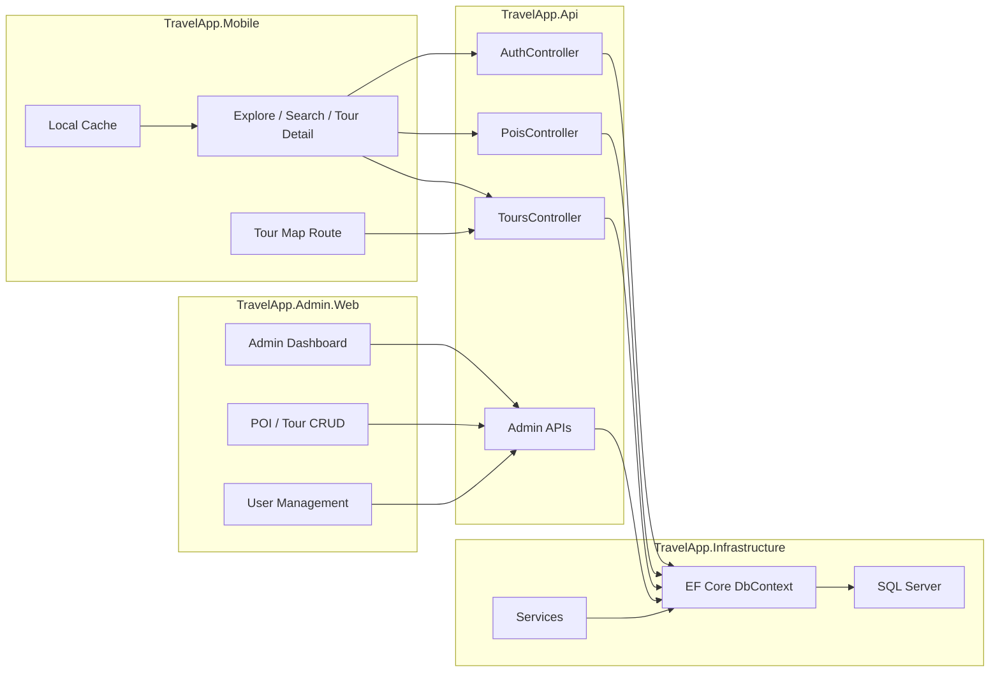

# 🌏 TravelApp


TravelApp là một nền tảng du lịch/POI đa thành phần gồm:

- `TravelApp.Mobile` — ứng dụng `.NET MAUI` dành cho mobile
- `TravelApp.Api` — backend `ASP.NET Core Web API`
- `TravelApp.Admin.Web` — web admin để quản lý dữ liệu
- `TravelApp.Application`, `TravelApp.Domain`, `TravelApp.Infrastructure` — lớp nghiệp vụ, domain và hạ tầng theo `Clean Architecture`

Ứng dụng hỗ trợ trải nghiệm offline-first, bản đồ, audio guide, tour route và quản trị nội dung tập trung.

## Sơ đồ kiến trúc



## Cấu trúc dự án

```text
TravelApp/
├── src/
│   ├── TravelApp.Mobile/        # .NET MAUI app
│   ├── TravelApp.Api/           # ASP.NET Core Web API
│   ├── TravelApp.Admin.Web/     # Web admin dashboard
│   ├── TravelApp.Application/   # Application layer
│   ├── TravelApp.Domain/        # Domain entities
│   └── TravelApp.Infrastructure/# EF Core, persistence, services
├── TravelApp.sln
└── README2.md
```

## Tính năng

### 📱 `TravelApp.Mobile`
- Khám phá POI/tour theo khu vực
- Bản đồ hiển thị POI và route tour
- `Live Tour Route` cho từng tour
- Tích hợp audio guide / TTS
- Đăng nhập, hồ sơ người dùng, lịch sử & bookmark
- Lưu cache cục bộ để hỗ trợ offline-first
- QR scanner
- Tìm kiếm và lọc tour/điểm đến

### 🌐 `TravelApp.Api`
- `ASP.NET Core` Web API
- Xác thực `JWT`
- Quản lý `POI`, `Tour`, `User`, `Refresh Token`
- EF Core migrations
- Tự migrate và bootstrap schema khi khởi động

### 🖥️ `TravelApp.Admin.Web`
- Dashboard quản trị
- CRUD `POI`
- CRUD `Tour`
- Gán POI vào tour
- Quản lý user / role
- Hiển thị thông báo validate và trạng thái thao tác

## Ảnh chụp màn hình

> Bạn có thể thay các file ảnh bên dưới bằng screenshot thực tế của project.

| Màn hình | Ảnh |
|---|---|
| Mobile Explore | `docs/screenshots/mobile-explore.png` |
| Mobile Tour Route | `docs/screenshots/mobile-tour-route.png` |
| Admin Dashboard | `docs/screenshots/admin-dashboard.png` |
| Admin POI Editor | `docs/screenshots/admin-poi-editor.png` |
| Admin Tour Editor | `docs/screenshots/admin-tour-editor.png` |

## Hướng dẫn cấu hình `appsettings`

### `TravelApp.Api`
File cấu hình chính:
- `src\TravelApp.Api\appsettings.json`
- `src\TravelApp.Api\appsettings.Development.json`

Các key quan trọng:

```json
{
  "ConnectionStrings": {
    "TravelAppDb": "Server=localhost\\SQLEXPRESS;Database=TravelAppDb;Trusted_Connection=True;TrustServerCertificate=True;MultipleActiveResultSets=true"
  },
  "Jwt": {
    "Secret": "...",
    "Issuer": "TravelApp",
    "Audience": "TravelAppUsers"
  }
}
```

- `ConnectionStrings:TravelAppDb`: chuỗi kết nối SQL Server
- `Jwt:Secret`: khóa ký token JWT
- `Jwt:Issuer`: issuer của token
- `Jwt:Audience`: audience của token

### `TravelApp.Admin.Web`
File cấu hình chính:
- `src\TravelApp.Admin.Web\appsettings.json`

Các key quan trọng:

```json
{
  "TravelAppApi": {
    "BaseUrl": "http://localhost:5293/"
  },
  "AdminCredentials": {
    "UserName": "admin",
    "Password": "admin123",
    "DisplayName": "admin"
  }
}
```

- `TravelAppApi:BaseUrl`: URL của API backend
- `AdminCredentials`: tài khoản quản trị mặc định cho web admin

## Tài khoản admin mặc định

### Admin Web

| Username | Password | Display name | Roles |
|---|---|---|---|
| `admin` | `admin123` | `admin` | `Admin` |

### Tài khoản demo đăng nhập API / Mobile

| Email | Password |
|---|---|
| `demo@example.com` | `Demo@123456` |
| `khanh@example.com` | `Khanh@123456` |
| `guest@example.com` | `Guest@123456` |

## Công nghệ sử dụng

| Layer | Technology |
|---|---|
| Mobile | .NET MAUI, Maps, MVVM |
| API | ASP.NET Core Web API |
| Admin | ASP.NET Core MVC / Razor Views |
| Persistence | Entity Framework Core |
| Database | SQL Server |
| Auth | JWT Bearer |
| Architecture | Clean Architecture |

## Yêu cầu môi trường

- .NET 10 SDK
- Visual Studio 2026 hoặc mới hơn
- Workload `MAUI`
- SQL Server
- Android Emulator hoặc thiết bị thật để chạy mobile app

## Hướng dẫn chạy từng project

### 1. `TravelApp.Api`

```powershell
cd src\TravelApp.Api
dotnet run
```

API sử dụng `appsettings.json` / `appsettings.Development.json` để lấy connection string và JWT config.

### 2. `TravelApp.Admin.Web`

```powershell
cd src\TravelApp.Admin.Web
dotnet run
```

Admin Web dùng `TravelAppApi:BaseUrl` để gọi API backend và `AdminCredentials` để đăng nhập mặc định.

### 3. `TravelApp.Mobile`

Mở `TravelApp.sln` bằng Visual Studio, chọn project `TravelApp.Mobile` và chạy trên emulator hoặc thiết bị thật.

Nếu muốn build từ terminal:

```powershell
cd src\TravelApp.Mobile
dotnet build
```

## Chạy dự án

### 1. API

```powershell
cd src\TravelApp.Api
dotnet run
```

API sẽ đọc connection string từ `appsettings.json` / `appsettings.Development.json` và tự áp migration khi khởi động.

### 2. Admin Web

```powershell
cd src\TravelApp.Admin.Web
dotnet run
```

### 3. Mobile App

Mở `TravelApp.sln` bằng Visual Studio và chạy project `TravelApp.Mobile` trên emulator hoặc thiết bị thật.

## Cấu hình quan trọng

### API
- `src\TravelApp.Api\appsettings.json`
- `src\TravelApp.Api\appsettings.Development.json`

Các cấu hình thường dùng:
- connection string `TravelAppDb`
- `Jwt:Secret`
- `Jwt:Issuer`
- `Jwt:Audience`

### Mobile
- `TravelApp.Mobile` dùng API client để gọi backend
- Dữ liệu POI/tour được cache cục bộ để hỗ trợ offline
- Route/tour và audio được tải lại khi online

### Admin
- `TravelApp.Admin.Web` dùng API client riêng để thao tác dữ liệu qua web

## Danh sách API endpoints

### Auth
| Method | Endpoint | Mô tả |
|---|---|---|
| `POST` | `/api/auth/login` | Đăng nhập |
| `POST` | `/api/auth/logout` | Thu hồi refresh token |
| `POST` | `/api/auth/refresh` | Làm mới access token |
| `GET` | `/api/auth/profile` | Lấy hồ sơ người dùng hiện tại |

### POI
| Method | Endpoint | Mô tả |
|---|---|---|
| `GET` | `/api/pois?lang=vi&pageNumber=1&pageSize=20` | Lấy danh sách POI |
| `GET` | `/api/pois/{id}` | Lấy POI theo id |
| `POST` | `/api/pois` | Tạo POI mới |
| `PUT` | `/api/pois/{id}` | Cập nhật POI |
| `DELETE` | `/api/pois/{id}` | Xóa POI |

### Tour
| Method | Endpoint | Mô tả |
|---|---|---|
| `GET` | `/api/tours` | Lấy danh sách tour đã publish |
| `GET` | `/api/tours/{anchorPoiId}` | Lấy tour theo Anchor POI |

### Admin API
| Method | Endpoint | Mô tả |
|---|---|---|
| `GET` | `/api/admin/tours` | Lấy tất cả tour |
| `GET` | `/api/admin/tours/{id}` | Lấy tour theo id |
| `POST` | `/api/admin/tours` | Tạo tour |
| `PUT` | `/api/admin/tours/{id}` | Cập nhật tour |
| `DELETE` | `/api/admin/tours/{id}` | Xóa tour |
| `GET` | `/api/admin/users` | Lấy tất cả user |
| `GET` | `/api/admin/users/{id}` | Lấy user theo id |
| `GET` | `/api/admin/users/roles` | Lấy danh sách role |
| `POST` | `/api/admin/users` | Tạo user |
| `PUT` | `/api/admin/users/{id}` | Cập nhật user |
| `DELETE` | `/api/admin/users/{id}` | Xóa user |

## Dữ liệu quản lý

Các entity chính:
- `Poi`
- `Tour`
- `TourPoi`
- `User`
- `Role`
- `RefreshToken`
- `PoiLocalization`
- `PoiAudio`

## Ghi chú

- Repo này đang theo hướng `offline-first`
- Logic nghiệp vụ nằm ở service layer, không đặt trong `ViewModel`
- Database được quản lý bằng `EF Core migrations`

## Troubleshooting

### Không kết nối được database
- Kiểm tra `src\TravelApp.Api\appsettings.json`
- Xác nhận `ConnectionStrings:TravelAppDb` đúng instance SQL Server
- Đảm bảo SQL Server đang chạy và cho phép kết nối

### API báo lỗi JWT
- Kiểm tra `Jwt:Secret`, `Jwt:Issuer`, `Jwt:Audience`
- Đảm bảo giá trị JWT giữa môi trường dev và build không bị lệch

### Admin Web không đăng nhập được
- Kiểm tra `src\TravelApp.Admin.Web\appsettings.json`
- Tài khoản mặc định:
  - `admin` / `admin123`

### Mobile app không tải dữ liệu
- Kiểm tra API đã chạy chưa
- Kiểm tra `TravelApp.Mobile` đang trỏ đúng base URL của API
- Thử `hot reload` hoặc restart app nếu đang debug

### Bản đồ không hiển thị đúng
- Kiểm tra quyền Location trên Android/iOS
- Kiểm tra dữ liệu POI có `Latitude` / `Longitude`
- Kiểm tra route/tour đã được publish và có waypoints hợp lệ

## Tài liệu liên quan

- `.github/copilot-instructions.md` — quy ước phát triển của repo

---

